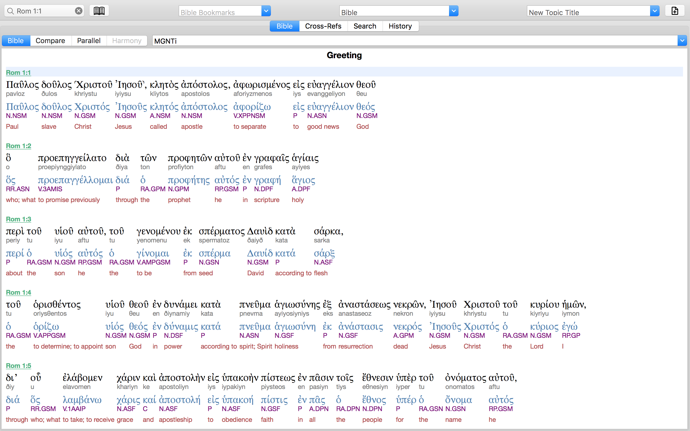

NOTE: UNZIP before installation 
NOTE: for Mac/iOS/iPhone (e-Sword X/HD/LT) only; PC version not supported yet 
 
 
 
MGNTi.bbli - bible module; interlinear (manuscript form, modern Greek pronunciation, lexeme, parsing, English gloss) 
MGNTi_zh.bbli - bible module; interlinear (manuscript form, modern Greek pronunciation, lexeme, parsing, Chinese gloss) 
MGNT.dcti - dictionary module; for lookup of Greek lexeme 
SBLGNT.dcti - dictionary module; for lookup of all words forms of Greek words in SBLGNT
