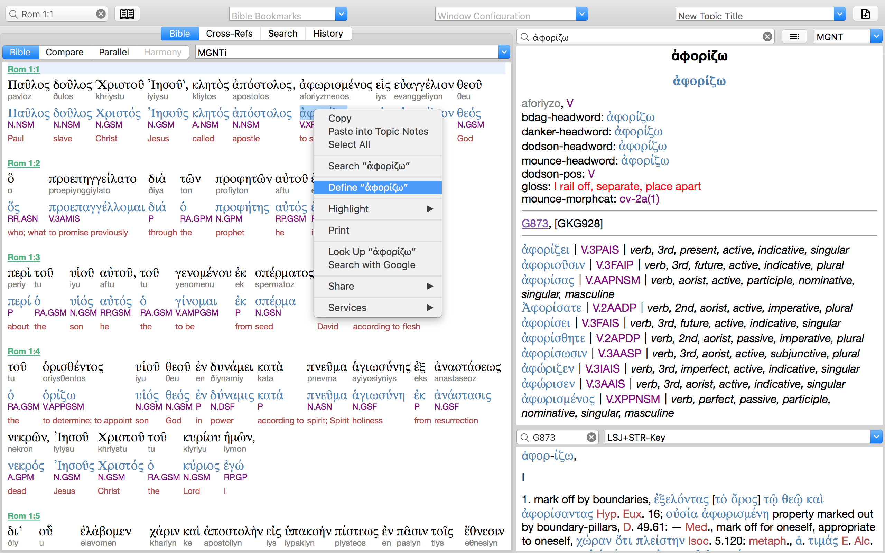

NOTE: UNZIP before installation 
NOTE: for Mac/iOS/iPhone (e-Sword X/HD/LT) only; PC version not supported yet, though you may be able to run the files in PC with e-Sword version 11+ 
 
 
 
MGNT.bbli - bible module; plain Greek text of SBLGNT; work with SBLGNT.dcti for dictionary lookup of every Greek forms of the text. 
MGNTi.bbli - bible module; interlinear (manuscript form, modern Greek pronunciation, lexeme, parsing, English gloss) 
MGNTi_zh.bbli - bible module; interlinear (manuscript form, modern Greek pronunciation, lexeme, parsing, Chinese gloss); testing ONLY 
MGNT.dcti - dictionary module; for lookup of Greek lexeme and morphological codes 
SBLGNT.dcti - dictionary module; for lookup of all words forms of Greek words in SBLGNT 
SBLGNTc.bbli - bible module; plain Greek text of SBLGNT + clause functions; work with SBLGNT.dcti for dictionary lookup of every Greek forms of the text.

<h2>SBLGNT with clause functions</h2>
<b>Source: </b>https://github.com/ETCBC/text-fabric-data/tree/master/greek/sblgnt 
<b>Source: </b>https://github.com/morphgnt/morphological-lexicon 
<b>Derivative work: </b>https://github.com/eliranwong/SBLGNT-add-ons 
 
<b>Credits: </b> 
- Asia Bible Society provides syntax trees data; free for non-commercial use 
- Jonathan Robie provides syntax trees data in xml format at https://github.com/biblicalhumanities/greek-new-testament/tree/master/syntax-trees/sblgnt; Jonathan Robie supports and advises on making this module. 
- Dirk Roorda provides Greek syntax trees data into text-fabric formats and advises on use of the data. 
- James Tauber provides data on morphological analysis adivse on use of the data 
 
<h2>Annotations of clause analysis</h2>
- <b>Adverbial Function (ADV): </b>A constituent that represents when, where, how, or why of a proposition.
- <b>Indirect Object Function (IO): </b>A constituent that represents the intended recipient of the action of a proposition.
- <b>Object Function (O): </b>A constituent that represents the patient or goal of the action of a proposition.
- <b>Second Object Function (O2): </b>Some verbs take two objects. There are two main types. The first type involves two accusative objects in the Greek, an object of person (the first object) and an object of thing (the second object). For example, he will teach you (object of person) all things (object of thing). The second type also involves two accusative objects in the Greek, but the first is the direct object and the second is an object complement. The object complement predicates a description of the direct object (e.g., "king" is the object complement in "God appointed David as king").
- <b>Subject Function (S): </b>A constituent that represents the agent of typically transitive verbs and the single argument of intransitive verbs.
- <b>Predicate Function (P): </b>A constituent that makes an attribution or identification about the Subject of a verbless clause or a verbal clause with a verbal copula.
- <b>Verbal Function (V): </b>A constituent that represents the action/event of a proposition. In verbal clauses, this is the head of the clause, on which all other clause constituents depend.
- <b>Verbal Copula Function (VC): </b>A constituent that facilitates an attribution or identification about the Subject. Verbal copulas are commonly known as copula verbs or linking verbs. This typically corresponds to a “to be” verb in English, which indicates a relation between the Subject and the Predicate rather than any action/event. 
